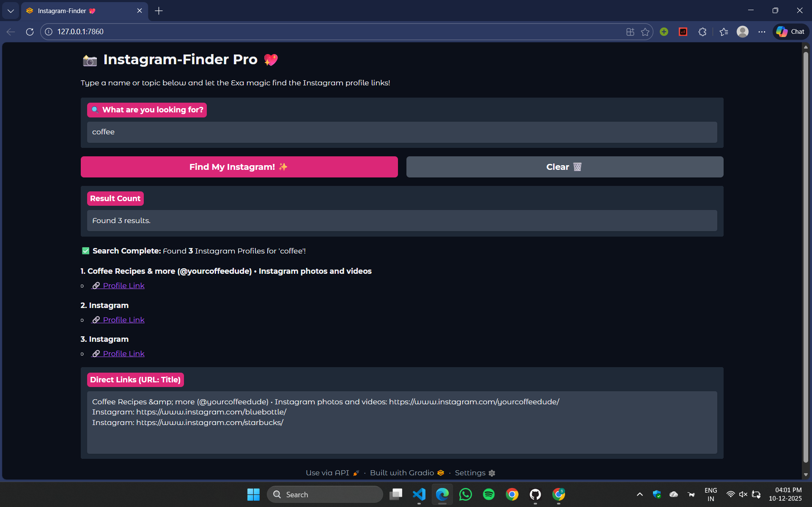

# Custom-Search-Engine-with-Exa
Just some website that can extract all those cute cat videos for you.

A simple web application built with Python and Gradio that uses the Exa API to quickly find Instagram profiles based on keywords or names.

I was making a simple project from Codedex, of making this simple "Custom Search engine with EXA," and that is the main.py file I have attached.

After that, I thought it was fun to create a simple GUI with Gradio, which makes UI development a matter of a few lines of code. Therefore, I created a Main file, search.py, and a GUI file, gui.py.
 
## ✨ Features

* **Targeted Search:** Specifically searches within the `instagram.com` domain.
* **Personality Focus:** Automatically modifies queries (e.g., "Beyonce" becomes "Beyonce instagram profile") to prioritize finding official accounts.
* **Robust Backend:** Utilizes the Exa API for intelligent, keyword-based search results.

## 🖼️ Visual Preview

A screenshot of the running application showing the search interface and results:  

<p align="center">
  
  &nbsp; &nbsp; &nbsp; &nbsp; 
  
</p>

---
## 🚀 Installation

### Prerequisites

You need to have Python (version 3.7 or later) installed on your system.

1.  **Get an Exa API Key:**
    * Sign up for an account at [https://exa.ai/](https://exa.ai/) to get your API key.

2.  **Install Dependencies:**
    Open your terminal or command prompt and run:
    pip install exa-py gradio

### Project Setup

1.  **Save the Files:** Ensure you have two files in the same directory:
    * `search.py` (The Python backend containing the `search_instagram_profiles` function and Exa setup).
    * `gui.py` (The Python frontend containing the Gradio interface).

2.  **Configure Your API Key:**
    Open the `search.py` file and replace the placeholder value with your actual Exa API key:
    ```python
    EXA_API_KEY = 'YOUR_ACTUAL_EXA_API_KEY_HERE' 
    ```

## 💻 How to Run

1.  **Navigate to the project directory** in your terminal.

2.  **Run the GUI file:**

    ```bash
    python gui.py
    ```

3.  **Access the Application:**
    The application will start and print a local URL (e.g., `http://127.0.0.1:7860`). Open this link in your web browser.

## 🤝 Contributing

Feel free to fork this repository, submit pull requests, or open issues to suggest improvements and report bugs.
